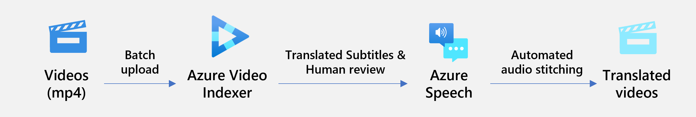

# Video translation using Azure AI

This repo shows how video content, e.g. learning videos, can be translated using Azure Video Indexer and Azure Speech.



This solution uses:

* Azure Video Indexer to index videos and create subtitles in the source and all destination languages
* Azure Speech to synthesize translated subtitles back to audio
* `ffmpeg` and `pydub` to create a full, translated audio track that is (reasonably) in sync with the video

## Instructions

Create a `Video Indexer` and `Azure Speech` resource in your azure subscription. Then rename `.env.example` to `.env` and update the following settings:

```
LOCATION=xxxxxxx
ACCOUNT_ID=xxxxxxx
ACCOUNT_NAME=xxxxxxxx
RESOURCE_ID=/subscriptions/xxxxxxxxxxxx/resourceGroups/xxxxxxxxxx/providers/Microsoft.VideoIndexer/accounts/xxxxxxxxx
SPEECH_API_URL=https://xxxxxxx.tts.speech.microsoft.com/cognitiveservices/v1
SPEECH_API_KEY=xxxxxxxx
INPUT_VIDEO_PATH=input_videos
OUTPUT_VIDEO_PATH=output_videos
OUTPUT_AUDIO_SNIPPETS_PATH=output_audio_snippets
OUTPUT_AUDIO_TRACKS_PATH=output_audio_tracks
OUTPUT_RAW_SUBTITLES_PATH=output_raw_subtitles
OUTPUT_PROCESSED_SUBTITLES_PATH=output_processed_subtitles
```

Replace `LOCATION`, `ACCOUNT_ID`, `ACCOUNT_NAME` and `RESOURCE_ID` with your Video Indexer details. Then update `SPEECH_API_URL` and `SPEECH_API_KEY` with your Speech resource details.

Then create a folder named `input_videos` and upload a few videos files you want to translate. Finally run the scripts in order and your translated videos should appear in the `output_videos` folder:

```console
pip install -f requirements.txt
python 00_ingest_videos.py
python 01_... and so on
```

Optionally, also adapt `settings.yml` if you want to add or remove additional languages. See [supported languages](https://learn.microsoft.com/en-us/azure/cognitive-services/speech-service/language-support?tabs=stt-tts#supported-languages) for a full list of speaker voices. Furthermore you can use the `overdub_original_audio` setting to determine, if the original audio track should be used in the translated video. In this case, the original track is automatically lowered in volume when the original voice was speaking, and then replaced with the translated, synthesized voice.